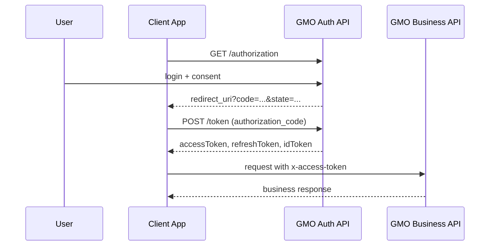
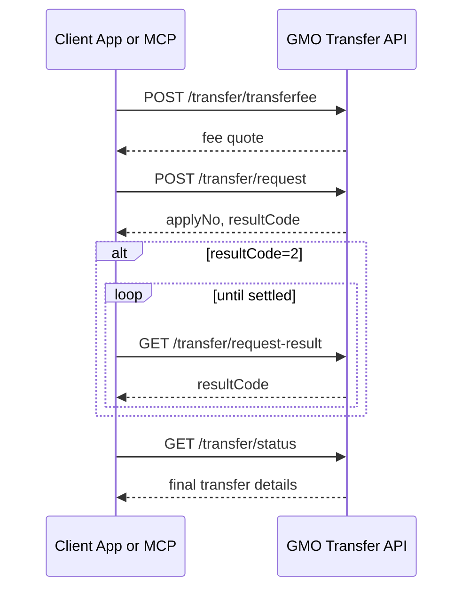
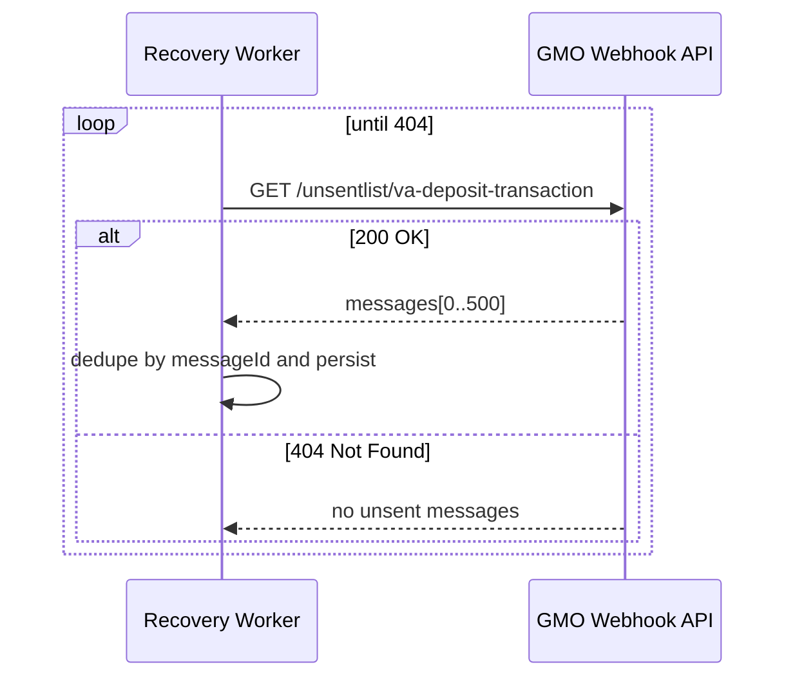

# GMOあおぞらネット銀行 API 極限リファレンス

最終更新: 2026-03-13  
対象: GMOあおぞらネット銀行の公開APIを使って実装する開発者、設計者、MCPサーバー実装者

## 0. この文書の位置づけ

この文書は、GMOあおぞらネット銀行の公開APIについて、公式の一次情報を横断して実務向けに再構成した高密度リファレンスです。

- 公式API開発者ポータル
- 公式API仕様書PDF
- 公式SDK群

を元に、認証、エンドポイント群、パラメータ制約、ページング、代表的な落とし穴、MCP化する際の設計観点まで整理しています。

注意:

- この文書は公開リポジトリ向けです。実口座情報、実クレデンシャル、実証明書、実取引データは一切含めません。
- 一部の表現は複数の公式ソースを統合した要約です。
- 公式SDK間で一部表記ゆれがあるため、実装時は必ず最新ポータルでも再確認してください。

## 1. 全体像

GMOあおぞらネット銀行のAPIは、大きく次の面で構成されています。

1. 認可 API
2. トークン API
3. 法人 API
4. 個人 API
5. Webhook API

公式SDKの構成を見ると、`authorization`、`corporate`、`personal`、`webhook` が明確に分かれています。  
つまり、実装上は「OAuth系」と「業務API系」に分離して考えると理解しやすいです。

### 1.1 API群の役割

| API群 | 役割 |
| --- | --- |
| Auth | 認可コード取得、アクセストークン取得、リフレッシュ |
| Account | 口座一覧、残高、入出金明細、振込入金明細、Visaデビット明細 |
| Transfer | 振込手数料事前照会、振込依頼、振込状況照会 |
| Transfer Common | 振込取消、振込依頼結果照会 |
| Bulk Transfer | 総合振込の手数料照会、依頼、状況照会 |
| Virtual Account | 振込入金口座の発行、一覧、状態変更、解約申込、入金明細照会 |
| Webhook | 通知配信制御、未送信明細取得 |

## 2. 環境とベースURL

公式PHP SDKのREADMEに基づく環境URLは次のとおりです。

### 2.1 認可系

| 環境 | Base URL |
| --- | --- |
| STG | `https://stg-api.gmo-aozora.com/ganb/api/auth/v1` |
| PROD | `https://api.gmo-aozora.com/ganb/api/auth/v1` |

### 2.2 個人API

| 環境 | Base URL |
| --- | --- |
| STG | `https://stg-api.gmo-aozora.com/ganb/api/personal/v1` |
| PROD | `https://api.gmo-aozora.com/ganb/api/personal/v1` |

### 2.3 法人API

| 環境 | Base URL |
| --- | --- |
| STG | `https://stg-api.gmo-aozora.com/ganb/api/corporation/v1` |
| PROD | `https://api.gmo-aozora.com/ganb/api/corporation/v1` |

### 2.4 Webhook API

ここは公式ソース間で表記に揺れがあります。

- PHP SDK README: `https://stg-api.gmo-aozora.com/ganb/api/webhook/v1`
- Java SDK WebhooksApi: `https://stg-pi.gmo-aozora.com/ganb/api/webhooks/v1`

この差異は実装前に必ず最新ポータルで確認してください。  
Webhook系は特にホスト名とパスの整合性をハードコードせず、設定で切り替えられるようにしておくのが安全です。

## 3. 認証と認可

## 3.1 認可フローの基本

公開SDKと認可API文書から読み取れる基本フローは OAuth 2.0 / OpenID Connect 系の認可コードフローです。

1. クライアントが `/authorization` へ遷移URLを生成する
2. ユーザーが認証・認可を行う
3. 認可コードが `redirect_uri` に返る
4. `/token` に認可コードを渡してアクセストークンを取得する
5. 業務API呼び出し時は `x-access-token` にアクセストークンを入れる
6. `offline_access` を要求していた場合はリフレッシュトークンを使って再発行できる

## 3.2 認可エンドポイント

| メソッド | パス | 用途 |
| --- | --- | --- |
| `GET` | `/authorization` | ユーザー認証・認可を得る |

主要パラメータ:

| パラメータ | 必須 | 内容 |
| --- | --- | --- |
| `client_id` | 必須 | 事前発行されるクライアントID |
| `redirect_uri` | 必須 | 事前登録済みのリダイレクトURI |
| `response_type` | 必須 | `code` 固定 |
| `scope` | 必須 | 要求スコープ。複数はスペース区切り |
| `state` | 必須 | CSRF対策用ランダム値 |
| `nonce` | 任意 | IDトークンとクライアントセッション紐付け用 |

重要ポイント:

- `state` は必須級です。戻り時に必ず照合するべきです。
- `nonce` は OIDC 的なリプレイ防止用途です。IDトークンを使うなら毎回生成して検証すべきです。
- リフレッシュトークンが必要なら `scope` に `offline_access` が必要です。

### 3.3 公式SDKに出てくるスコープ例

公式Node.js SDKの認可サンプルには次のスコープ例が出ています。

```text
private:account private:virtual-account private:transfer private:bulk-transfer
```

ここから少なくとも以下の権限概念があることが分かります。

- `private:account`
- `private:virtual-account`
- `private:transfer`
- `private:bulk-transfer`
- `offline_access`

補足:

- Webhook用スコープ名称は確認できる一次情報をこの調査では特定できませんでした。
- 契約形態や利用申込内容によって実際に付与されるスコープは変わる可能性があります。

## 3.4 トークンエンドポイント

| メソッド | パス | 用途 |
| --- | --- | --- |
| `POST` | `/token` | アクセストークン新規発行、再発行 |

公式資料から確認できる仕様:

- 新規発行時の `grant_type` は `authorization_code`
- 再発行時の `grant_type` は `refresh_token`
- クライアント認証方式は少なくとも次の2種
  - `basic`
  - `post`

### 3.5 トークン要求の要点

| 項目 | 新規発行 | 再発行 |
| --- | --- | --- |
| `grant_type` | `authorization_code` | `refresh_token` |
| `code` | 必須 | 不要 |
| `refresh_token` | 不要 | 必須 |
| `redirect_uri` | 必須 | 不要 |
| `client_id` | `post` のとき必須 | `post` のとき必須 |
| `client_secret` | `post` のとき必須 | `post` のとき必須 |

### 3.6 トークン応答

公式SDKの `TokenResponse` から確認できる主要フィールド:

| フィールド | 内容 |
| --- | --- |
| `accessToken` | 業務API呼び出し時に `x-access-token` へ入れる値 |
| `refreshToken` | アクセストークン再発行用 |
| `scope` | 許可されたスコープ |
| `tokenType` | トークン種別 |
| `expiresIn` | 有効期限秒数 |
| `idToken` | JWT形式。任意 |

### 3.7 認証系エラー

Auth系 `ErrorResponse` では次のエラーコードが確認できます。

- `invalid_request`
- `invalid_client`
- `invalid_grant`
- `unauthorized_client`
- `unsupported_grant_type`
- `invalid_scope`
- `server_error`

実装上の要点:

- `invalid_grant` は認可コード不正や `redirect_uri` 不一致で出る
- `invalid_client` はクライアントID/シークレット不整合を疑う
- `invalid_scope` は契約・申込・利用許可の不足も疑う

## 4. 共通実装ルール

## 4.1 認証ヘッダー

業務APIの多くは `x-access-token` を要求します。  
SDK docs の `Authorization` 欄には "No authorization required" と書かれていても、これはSDK生成文書の表現であり、実際には `x-access-token` パラメータが必須です。

つまり実装上は:

- HTTPヘッダー `x-access-token: <access token>`

を必ず付与する前提で考えるべきです。

## 4.2 日付形式

日付系は `YYYY-MM-DD` が基本です。  
時刻付き項目は応答側に `HH:MM:SS+09:00` 形式が登場します。

## 4.3 ページング

多くの照会APIは 500 件上限で、`nextItemKey` によるページングです。

パターン:

1. 初回は `nextItemKey` なし
2. 応答に次キーがあれば次回リクエストへ同一条件で付与
3. これを繰り返して全件取得

注意:

- 初回と条件を変えると意図しない取りこぼしや重複の原因になります。
- Webhookの未送信一覧だけは「404になるまで取り続ける」という別ルールです。

## 4.4 空データ時の扱い

多くの照会APIは「該当なしでも `200 OK`」です。  
Webhook未送信一覧は「該当なしで `404 Not Found`」という別挙動です。

この差はクライアント実装で吸収が必要です。

## 4.5 文字種・コード値

複数の項目で以下が繰り返し出ます。

- 半角数字
- 半角文字
- 半角カナ英数記号
- 振込許容文字

特に振込名義、EDI情報、追加名義カナは文字種制約が厳しいため、MCPツール化するときは入力前バリデーションを持たせた方が安全です。

## 5. 口座系 API

法人・個人の両方で、SDK上は同じAPI群が定義されています。  
以下は法人APIのパスを基準に記載します。個人は `/corporation/` が `/personal/` に変わると考えると理解しやすいです。

## 5.1 口座API一覧

| メソッド | パス | 内容 |
| --- | --- | --- |
| `GET` | `/accounts` | 口座一覧照会 |
| `GET` | `/accounts/balances` | 残高照会 |
| `GET` | `/accounts/transactions` | 入出金明細照会 |
| `GET` | `/accounts/deposit-transactions` | 振込入金明細照会 |
| `GET` | `/accounts/visa-transactions` | Visaデビット取引明細照会 |

## 5.2 口座一覧照会

- 保有する全口座の一覧を取得
- `x-access-token` 必須

MCPで使うなら:

- `list_accounts`
- 結果を `accountId` ごとにキャッシュ

が基本になります。

## 5.3 残高照会

- `accountId` 指定あり: 単一口座
- `accountId` 省略: 全口座

MCP化では `get_balance(account_id?)` の形が自然です。

## 5.4 入出金明細照会

パス: `GET /accounts/transactions`

主な制約:

- 対象は円普通預金口座
- 上限 500件
- ソートは昇順
- `dateFrom` / `dateTo` の組み合わせに応じて対象範囲が変わる
- `nextItemKey` でページング

## 5.5 振込入金明細照会

パス: `GET /accounts/deposit-transactions`

主な制約:

- 対象は円普通預金口座
- 上限 500件
- ソートは昇順
- ページングあり
- 該当なしでも `200 OK`

## 5.6 Visaデビット取引明細照会

パス: `GET /accounts/visa-transactions`

特徴:

- 対象は Visa デビットカード保有口座
- 上限 500件
- ただし 1回の検索総件数が 99,999 件超は `400 Bad Request`
- ソート順は降順
- ページングあり

## 6. 振込 API

## 6.1 API一覧

| 分類 | メソッド | パス | 内容 |
| --- | --- | --- | --- |
| Transfer | `POST` | `/transfer/transferfee` | 振込手数料事前照会 |
| Transfer | `POST` | `/transfer/request` | 振込依頼 |
| Transfer | `GET` | `/transfer/status` | 振込状況照会 |
| Transfer Common | `POST` | `/transfer/cancel` | 振込取消依頼 |
| Transfer Common | `GET` | `/transfer/request-result` | 振込依頼結果照会 |

## 6.2 振込手数料事前照会

パス: `POST /transfer/transferfee`

用途:

- 振込前に入力妥当性と手数料を確認する

公式ドキュメント上の重要ポイント:

- 最大 99件まで登録可能
- 1件なら通常振込
- 2件以上なら一括振込扱い
- 手数料は実行時点で変動し得る
- 無料回数やポイントは計算対象から除外される

実装方針:

- `request` の前に必ず `transferfee` を呼ぶワークフローが安全
- UIやMCPでは「見積」と「実行」を分ける

## 6.3 振込依頼

パス: `POST /transfer/request`

用途:

- 振込または振込予約を申請する

主な制約:

- 最大 99件
- 1件なら通常振込
- 2件以上なら一括振込扱い

### 6.3.1 TransferRequest の重要フィールド

| フィールド | 内容 |
| --- | --- |
| `accountId` | 出金元口座ID |
| `remitterName` | 振込依頼人名。省略時は口座名義 |
| `transferDesignatedDate` | 振込指定日 |
| `transferDateHolidayCode` | 非営業日扱い。`1=翌営業日` `2=前営業日` `3=エラー` |
| `totalCount` | 合計件数。1〜99。1件なら省略可 |
| `totalAmount` | 合計金額。1件なら省略可 |
| `applyComment` | ビジネスID管理利用中の申請コメント |
| `transfers` | 振込明細配列 |

### 6.3.2 Transfer 明細の重要フィールド

| フィールド | 内容 |
| --- | --- |
| `itemId` | 明細番号。1件なら省略可 |
| `transferAmount` | 振込金額 |
| `ediInfo` | EDI情報 |
| `beneficiaryBankCode` | 仕向先金融機関コード |
| `beneficiaryBranchCode` | 仕向先支店コード |
| `accountTypeCode` | `1=普通` `2=当座` `4=貯蓄` `9=その他` |
| `accountNumber` | 7桁未満は左ゼロ埋め相当で扱う前提 |
| `beneficiaryName` | 受取人名 |

## 6.4 振込状況照会

パス: `GET /transfer/status`

用途:

- 仕向の振込状況、履歴の照会

主な仕様:

- 上限 500件
- ページングあり
- `queryKeyClass`
  - `1`: 振込申請番号指定
  - `2`: 条件で一括照会
- `requestTransferTerm`
  - `1`: 振込申請受付日基準
  - `2`: 振込指定日基準
- `requestTransferClass`
  - `1`: ALL
  - `2`: 振込申請のみ
  - `3`: 振込受付情報のみ

重要な運用ルール:

- `申請中` 以降が照会対象
- `依頼中`、`作成中` は照会対象外
- APIから作ったものだけでなく、定額自動振込で自動登録された振込も照会対象

## 6.5 振込取消依頼

パス: `POST /transfer/cancel`

用途:

- 振込、振込予約、総合振込の取消申請

重要ルール:

- `申請中` 以降は取消可能
- `依頼中`、`作成中` は取消不可
- 同じ `applyNo` に重複依頼は不可

### 6.5.1 cancelTargetKeyClass

| 値 | 意味 |
| --- | --- |
| `1` | 振込申請取消 |
| `2` | 振込受付取消 |
| `3` | 総合振込申請取消 |
| `4` | 総合振込受付取消 |

法人のビジネスID管理利用状況によって指定可能値が変わる点が重要です。

## 6.6 振込依頼結果照会

パス: `GET /transfer/request-result`

用途:

- 更新系APIの処理結果照会

対象:

- 振込依頼
- 総合振込依頼
- 振込取消依頼

実装上の使い方:

- 非同期っぽい処理結果確認APIとして扱う
- `request` 後に `applyNo` をキーにポーリングする

## 7. 総合振込 API

## 7.1 API一覧

| メソッド | パス | 内容 |
| --- | --- | --- |
| `POST` | `/bulktransfer/transferfee` | 総合振込手数料事前照会 |
| `POST` | `/bulktransfer/request` | 総合振込依頼 |
| `GET` | `/bulktransfer/status` | 総合振込状況照会 |

## 7.2 総合振込手数料事前照会

特徴:

- 実行時の制度変更や税変更で手数料が変わり得る
- ポイントは計算対象外

## 7.3 総合振込依頼

用途:

- 総合振込の申請

### 7.3.1 BulkTransferRequest の重要フィールド

| フィールド | 内容 |
| --- | --- |
| `accountId` | 出金元口座ID |
| `remitterName` | 振込依頼人名 |
| `transferDesignatedDate` | 振込指定日 |
| `transferDateHolidayCode` | 非営業日調整コード |
| `transferDataName` | 総合振込データ識別用メモ |
| `totalCount` | 1〜9,999 |
| `totalAmount` | 合計金額 |
| `applyComment` | 申請コメント |
| `bulkTransfers` | 明細配列 |

### 7.3.2 BulkTransfer 明細の重要フィールド

| フィールド | 内容 |
| --- | --- |
| `itemId` | 明細番号。1〜9999 |
| `beneficiaryBankCode` | 金融機関コード |
| `beneficiaryBranchCode` | 支店コード |
| `accountTypeCode` | 預金種別 |
| `accountNumber` | 口座番号 |
| `beneficiaryName` | 受取人名 |
| `transferAmount` | 金額 |
| `ediInfo` | EDI情報 |
| `identification` | `Y` ならEDI通知、空/NULL/スペースなら通知しない |

参考値で処理に使わないと明記されているフィールドもあります。

- `beneficiaryBankName`
- `beneficiaryBranchName`
- `clearingHouseName`
- `newCode`
- `transferDesignnatedType`

これらは入力しても銀行側で処理判断に使わない前提で設計した方がよいです。

## 7.4 総合振込状況照会

パス: `GET /bulktransfer/status`

重要ポイント:

- 1回で取得できるのは最大500件
- `detailInfoNecessity=true` のときは総合振込明細情報を取る
- `bulktransferItemKey` で明細の取得開始位置を指定
- 1500件を取るなら `1`, `501`, `1001` のように分割
- 対象は現在契約中の総合振込サービスのみ

### 7.4.1 総合振込状況照会の設計上の難所

- 一覧照会と明細照会が同じAPIで切り替わる
- `nextItemKey` と `bulktransferItemKey` の役割が異なる
- UIやMCPでは「申請一覧取得」と「特定申請の明細展開」を別ツールに分けた方が扱いやすい

## 8. 振込入金口座 API

## 8.1 API一覧

| メソッド | パス | 内容 |
| --- | --- | --- |
| `GET` | `/va/deposit-transactions` | 振込入金口座入金明細照会 |
| `POST` | `/va/issue` | 振込入金口座発行 |
| `POST` | `/va/status-change` | 振込入金口座状態変更 |
| `POST` | `/va/list` | 振込入金口座一覧照会 |
| `POST` | `/va/close-request` | 振込入金口座解約申込 |

## 8.2 振込入金口座発行

パス: `POST /va/issue`

重要ポイント:

- 1リクエストで最大 1000口座
- 銀行メンテ時は実行できないため、事前に余剰発行してプールしておくことが推奨されている

### 8.2.1 VaIssueRequest の重要フィールド

| フィールド | 内容 |
| --- | --- |
| `vaTypeCode` | `1=期限型`, `2=継続型` |
| `issueRequestCount` | 発行口座数 |
| `raId` | 入金先口座ID |
| `vaContractAuthKey` | 通常は `NULL` 前提 |
| `vaHolderNameKana` | 追加名義カナ |
| `vaHolderNamePos` | `1=後ろ`, `2=前` |

追加名義カナは特に制約が細かいです。

- 利用記号は限定
- 口座名義カナとの合計40文字以内
- 前置時のスペースルールあり
- 連続スペース不可

MCPツールにする場合はここを前処理で厳格検証すべきです。

## 8.3 振込入金口座状態変更

パス: `POST /va/status-change`

`vaStatusChangeCode`:

| 値 | 意味 |
| --- | --- |
| `1` | 停止 |
| `2` | 再開 |
| `3` | 削除 |

制約:

- 1リクエスト最大100口座

## 8.4 振込入金口座一覧照会

パス: `POST /va/list`

特徴:

- 取得上限 500件
- `nextItemKey` によるページング
- 発行日時昇順
- 多数のフィルタ条件を持つ

主なフィルタ:

- `vaTypeCode`
- `depositAmountExistCode`
- `vaHolderNameKana`
- `vaStatusCodeList`
- `latestDepositDateFrom/To`
- `vaIssueDateFrom/To`
- `expireDateFrom/To`
- `raId`
- `vaIdList`
- `sortItemCode`
- `sortOrderCode`

### 8.4.1 sortItemCode

| 値 | 意味 |
| --- | --- |
| `1` | 有効期限日時 |
| `2` | 最終入金日 |
| `3` | 発行日時 |
| `4` | 最終入金金額 |

### 8.4.2 sortOrderCode

| 値 | 意味 |
| --- | --- |
| `1` | 昇順 |
| `2` | 降順 |

## 8.5 振込入金口座入金明細照会

パス: `GET /va/deposit-transactions`

特徴:

- `raId` または `vaId` のどちらかが事実上必要
- 上限 500件
- `dateFrom/dateTo` は照会日から6ヶ月以内制約
- `sortOrderCode`: `1=昇順`, `2=降順`
- ページングあり

## 8.6 振込入金口座解約申込

パス: `POST /va/close-request`

重要ポイント:

- 解約は受付月の月末に行われる

つまり「即時無効化API」ではなく、「月末解約申込API」と理解した方が運用事故を防げます。

## 9. Webhook API

## 9.1 API一覧

| メソッド | パス | 内容 |
| --- | --- | --- |
| `POST` | `/subscribe` | 通知配信制御 |
| `GET` | `/unsentlist/va-deposit-transaction` | 未送信入金明細取得 |

## 9.2 通知配信制御

パス: `POST /subscribe`

用途:

- イベント通知の配信開始・停止

### 9.2.1 認証方式

Webhook APIの認証は `x-access-token` ではなく、公式文書では:

- 銀行システムが配信先システムに発行した `clientId:clientSecret` を Base64 エンコードした値

を `authorization` に設定すると説明されています。

このため、通常のOAuthアクセストークンベースとは別物として設計した方が安全です。

### 9.2.2 SubscribeRequestBody

| フィールド | 内容 |
| --- | --- |
| `subscribeStatus` | `0=配信停止要求`, `1=配信開始要求` |
| `eventTypes` | イベント種別配列 |

### 9.2.3 EventType

現時点で公開SDKから確認できるイベント種別:

- `va-deposit-transaction`

これは「振込入金口座への入金明細通知」です。

## 9.3 未送信入金明細取得

パス: `GET /unsentlist/va-deposit-transaction`

特徴:

- 配信停止中または送信エラー時の救済取得API
- 未送信/送信エラー明細を一括取得
- 本APIで取得した明細は配信済み扱いになる
- 法人口座および個人事業主口座のみ対象
- 個人口座は対象外
- 取得上限 500件
- 明細が残っている可能性がある限り繰り返し取得
- 明細が無くなったら `404 Not Found`

MCPや運用バッチの実装では:

- `404` をエラーではなく「枯渇シグナル」と扱う
- 再取得ループの停止条件にする

のがポイントです。

## 10. 法人APIと個人APIの違い

公式SDK上では、個人APIと法人APIは非常に近いAPI面を持ちます。  
ただし、各フィールド説明には法人特有の注記が頻繁に出ます。

代表例:

- ビジネスID管理利用中のみ有効な `applyComment`
- ビジネスID管理利用有無で変わる取消区分
- 総合振込機能
- Webhook未送信取得の対象外となる個人口座

このため設計上は次の切り分けが有効です。

- 共通クライアント
- 契約種別ごとの差分バリデータ
- 法人専用ツール
- 個人/法人共通ツール

## 11. 実装時の落とし穴

## 11.1 SDK文書の "No authorization required" を誤解しない

生成ドキュメント上はそう見えても、実際には `x-access-token` パラメータ必須です。  
ここを誤解すると「認証不要API」と勘違いして実装事故になります。

## 11.2 WebhookのURL表記差異

先述の通り、`webhook` / `webhooks`、`stg-api` / `stg-pi` の差異があります。  
固定実装ではなく設定化し、接続テストを最初の工程に入れるべきです。

## 11.3 200で空、404で空、の混在

同じ「該当なし」でもAPIごとに意味が違います。

- 多くの明細照会: `200 OK` + 明細なし
- Webhook未送信一覧: `404 Not Found`

## 11.4 日付条件の意味がAPIごとに違う

同じ `dateFrom` / `dateTo` でも:

- 当日扱い
- 最古からToまで
- 6ヶ月以内制約
- ソート基準の違い

があり、共通の検索UIを作るときに一律に扱うと危険です。

## 11.5 総合振込は単なる大量振込ではない

総合振込は:

- 独自の依頼API
- 独自の状況照会API
- 明細取得フラグ
- 明細開始キー

を持っており、通常振込をループして代替する思想では整理しづらいです。

## 11.6 仮想口座名義の文字種制約

`vaHolderNameKana` は実装事故が起きやすいです。  
入力時点で厳格正規化と長さ検証をしないと、生成失敗の原因になります。

## 12. MCPサーバーに落とし込むなら

## 12.1 最小ツールセット

公開MCPとして作るなら、まずは次のツール群が現実的です。

| MCPツール案 | 対応API |
| --- | --- |
| `list_accounts` | `/accounts` |
| `get_balances` | `/accounts/balances` |
| `get_transactions` | `/accounts/transactions` |
| `get_deposit_transactions` | `/accounts/deposit-transactions` |
| `quote_transfer_fee` | `/transfer/transferfee` |
| `create_transfer_request` | `/transfer/request` |
| `get_transfer_status` | `/transfer/status` |
| `get_transfer_request_result` | `/transfer/request-result` |
| `cancel_transfer` | `/transfer/cancel` |
| `quote_bulk_transfer_fee` | `/bulktransfer/transferfee` |
| `create_bulk_transfer_request` | `/bulktransfer/request` |
| `get_bulk_transfer_status` | `/bulktransfer/status` |
| `issue_virtual_accounts` | `/va/issue` |
| `list_virtual_accounts` | `/va/list` |
| `get_virtual_account_deposits` | `/va/deposit-transactions` |
| `change_virtual_account_status` | `/va/status-change` |
| `close_virtual_account_contract` | `/va/close-request` |
| `set_webhook_subscription` | `/subscribe` |
| `fetch_unsent_webhook_messages` | `/unsentlist/va-deposit-transaction` |

## 12.2 実装順序

おすすめ順:

1. 認可URL生成
2. トークン取得/更新
3. 口座一覧
4. 残高
5. 入出金明細
6. 振込見積
7. 振込依頼
8. 状況照会
9. 仮想口座
10. Webhook

理由:

- まず読み取り系で疎通と権限を固める
- 次に書き込み系を段階的に増やす
- WebhookはURL差異と運用設計が絡むため最後

## 12.3 安全設計

- トークンは永続化するなら暗号化
- `state` と `nonce` を必ず検証
- `x-access-token` をログ出力しない
- `applyNo`、`accountId`、`vaId` も公開リポジトリのログ例ではダミー化
- 本番とSTGの設定を完全分離
- 書き込み系APIは dry-run 相当の見積ツールと対にする

## 12.4 MCP向けのUX設計

LLMは誤操作しやすいため、書き込み系は最低でも2段階に分けると安全です。

例:

1. `quote_transfer_fee`
2. `create_transfer_request`

また、戻り値には次を必ず含めるべきです。

- 送信先口座要約
- 金額
- 指定日
- 受付番号 `applyNo`
- 追跡に使う照会キー

## 13. 公式ソースから見た未確定点

この調査時点で、次は公式ソース間で要確認です。

1. Webhookの正確な本番/STG URL
2. Webhook用スコープの正式名称
3. 個人APIと法人APIの機能差分の最新状態
4. 口座種別ごとの実利用可否

ここは「未確定のままコードに埋めない」が重要です。

## 14. 実装チェックリスト

- 認可URL生成で `state` を保存したか
- `nonce` を保存・検証したか
- `offline_access` の有無を要件化したか
- `x-access-token` を全業務APIで付与しているか
- `nextItemKey` を条件不変で引き継いでいるか
- `404` をWebhook未送信一覧の正常終了として扱っているか
- 振込依頼前に手数料事前照会を挟んでいるか
- 非営業日コードの扱いをUIで明示しているか
- 仮想口座名義の文字制約を前段バリデーションしているか
- STG/PROD/Webhook URLを設定化しているか

## 15. 参考ソース

- 公式API開発者ポータル: <https://api.gmo-aozora.com/ganb/developer/>
- 法人向けAPI仕様書PDF: <https://gmo-aozora.com/business/service/pdf/api-spec-corporate.pdf>
- 公式GitHub組織: <https://github.com/gmoaozora>
- Node.js SDK: <https://github.com/gmoaozora/gmo-aozora-api-nodejs>
- Java SDK: <https://github.com/gmoaozora/gmo-aozora-api-java>
- PHP SDK: <https://github.com/gmoaozora/gmo-aozora-api-php>

## 16. 一言でまとめると

GMOあおぞらAPIは、単純な残高照会APIではなく、

- OAuth認可
- 明細系の厳密なページング
- 振込の事前照会と申請分離
- 総合振込の独立面
- 仮想口座の大量発行/管理
- Webhookの運用面

まで含んだ、かなり実務寄りの銀行APIです。  
MCP化するなら「読み取り系から段階導入」「書き込み系は二段階確認」「環境差異を設定化」が成功パターンです。

## 17. 正規化したAPIインベントリ

この章は、実装時に「結局どのHTTPパスに、何を投げて、何が返るか」を一覧で引けるようにしたものです。

## 17.1 Auth API

| メソッド | パス | 主な入力 | 主な出力 | 備考 |
| --- | --- | --- | --- | --- |
| `GET` | `/authorization` | `client_id`, `redirect_uri`, `response_type=code`, `scope`, `state`, `nonce?` | 認可遷移 | ユーザーを認可画面へ送る |
| `POST` | `/token` | `TokenRequest` | `TokenResponse` | 新規発行とリフレッシュ両対応 |

## 17.2 口座API

| API種別 | メソッド | パス | 主な入力 | 主な出力 |
| --- | --- | --- | --- | --- |
| Corporate/Personal | `GET` | `/accounts` | `x-access-token` | `AccountsResponse` |
| Corporate/Personal | `GET` | `/accounts/balances` | `x-access-token`, `accountId?` | `BalancesResponse` |
| Corporate/Personal | `GET` | `/accounts/transactions` | `accountId`, `x-access-token`, `dateFrom?`, `dateTo?`, `nextItemKey?` | `TransactionsResponse` |
| Corporate/Personal | `GET` | `/accounts/deposit-transactions` | `accountId`, `x-access-token`, `dateFrom?`, `dateTo?`, `nextItemKey?` | `DepositTransactionsResponse` |
| Corporate/Personal | `GET` | `/accounts/visa-transactions` | `accountId`, `x-access-token`, `dateFrom?`, `dateTo?`, `nextItemKey?` | `VisaTransactionsResponse` |

## 17.3 振込API

| API種別 | メソッド | パス | 主な入力 | 主な出力 |
| --- | --- | --- | --- | --- |
| Transfer | `POST` | `/transfer/transferfee` | `TransferRequest`, `x-access-token` | `TransferFeeResponse` |
| Transfer | `POST` | `/transfer/request` | `TransferRequest`, `x-access-token` | `TransferRequestResponse` |
| Transfer | `GET` | `/transfer/status` | `accountId`, `queryKeyClass`, `x-access-token`, `applyNo?`, `dateFrom?`, `dateTo?`, `nextItemKey?`, `requestTransferStatuses?`, `requestTransferClass?`, `requestTransferTerm?` | `TransferStatusResponse` |
| Transfer Common | `POST` | `/transfer/cancel` | `TransferCancelRequest`, `x-access-token` | `TransferCancelResponse` |
| Transfer Common | `GET` | `/transfer/request-result` | `accountId`, `applyNo`, `x-access-token` | `TransferRequestResultResponse` |

## 17.4 総合振込API

| メソッド | パス | 主な入力 | 主な出力 |
| --- | --- | --- | --- |
| `POST` | `/bulktransfer/transferfee` | `BulkTransferRequest`, `x-access-token` | `TransferFeeResponse` |
| `POST` | `/bulktransfer/request` | `BulkTransferRequest`, `x-access-token` | `BulkTransferRequestResponse` |
| `GET` | `/bulktransfer/status` | `accountId`, `queryKeyClass`, `x-access-token`, `detailInfoNecessity?`, `bulktransferItemKey?`, `applyNo?`, `dateFrom?`, `dateTo?`, `nextItemKey?`, `requestTransferStatuses?`, `requestTransferClass?`, `requestTransferTerm?` | `BulkTransferStatusResponse` |

## 17.5 振込入金口座API

| メソッド | パス | 主な入力 | 主な出力 |
| --- | --- | --- | --- |
| `GET` | `/va/deposit-transactions` | `x-access-token`, `vaContractAuthKey?`, `raId?`, `vaId?`, `dateFrom?`, `dateTo?`, `sortOrderCode?`, `nextItemKey?` | `VaDepositTransactionsResponse` |
| `POST` | `/va/issue` | `VaIssueRequest`, `x-access-token` | `VaIssueResponse` |
| `POST` | `/va/status-change` | `VaStatusChangeRequest`, `x-access-token` | `VaStatusChangeResponse` |
| `POST` | `/va/list` | `VaListRequest`, `x-access-token` | `VaListResponse` |
| `POST` | `/va/close-request` | `VaCloseRequest`, `x-access-token` | `VaCloseRequestResponse` |

## 17.6 Webhook API

| メソッド | パス | 主な入力 | 主な出力 | 備考 |
| --- | --- | --- | --- | --- |
| `POST` | `/subscribe` | `authorization`, `SubscribeRequestBody` | 空レスポンス | 配信開始/停止 |
| `GET` | `/unsentlist/va-deposit-transaction` | `authorization` | `VaDepositTransactionUnsentResponse` | 未送信明細を回収 |

## 18. 実装用 JSON スケルトン

以下は公開安全なダミー値で作った実装用ひな型です。フィールド名は公式SDKのモデル名に寄せています。

## 18.1 TokenRequest: 新規発行

```json
{
  "grantType": "authorization_code",
  "code": "AUTH_CODE_EXAMPLE",
  "redirectUri": "https://example.com/oauth/callback",
  "clientId": "CLIENT_ID_EXAMPLE",
  "clientSecret": "CLIENT_SECRET_EXAMPLE"
}
```

## 18.2 TokenRequest: リフレッシュ

```json
{
  "grantType": "refresh_token",
  "refreshToken": "REFRESH_TOKEN_EXAMPLE",
  "clientId": "CLIENT_ID_EXAMPLE",
  "clientSecret": "CLIENT_SECRET_EXAMPLE"
}
```

## 18.3 TransferRequest: 単票振込

```json
{
  "accountId": "123456789012",
  "remitterName": "ｻﾝﾌﾟﾙｶｲｼｬ",
  "transferDesignatedDate": "2026-03-20",
  "transferDateHolidayCode": "1",
  "transfers": [
    {
      "transferAmount": "50000",
      "beneficiaryBankCode": "0001",
      "beneficiaryBranchCode": "001",
      "accountTypeCode": "1",
      "accountNumber": "0001234",
      "beneficiaryName": "ﾃｽﾄ ｳｹﾄﾘﾆﾝ",
      "ediInfo": "INV-20260320-001"
    }
  ]
}
```

## 18.4 BulkTransferRequest: 総合振込

```json
{
  "accountId": "123456789012",
  "remitterName": "ｻﾝﾌﾟﾙｶｲｼｬ",
  "transferDesignatedDate": "2026-03-25",
  "transferDateHolidayCode": "1",
  "transferDataName": "PAYROLL_2026_03",
  "totalCount": "2",
  "totalAmount": "350000",
  "bulkTransfers": [
    {
      "itemId": "1",
      "beneficiaryBankCode": "0001",
      "beneficiaryBranchCode": "001",
      "accountTypeCode": "1",
      "accountNumber": "0001111",
      "beneficiaryName": "ﾀﾅｶ ﾀﾛｳ",
      "transferAmount": "150000",
      "ediInfo": "SALARY_A"
    },
    {
      "itemId": "2",
      "beneficiaryBankCode": "0005",
      "beneficiaryBranchCode": "123",
      "accountTypeCode": "1",
      "accountNumber": "0002222",
      "beneficiaryName": "ｻﾄｳ ﾊﾅｺ",
      "transferAmount": "200000",
      "ediInfo": "SALARY_B"
    }
  ]
}
```

## 18.5 TransferCancelRequest

```json
{
  "accountId": "123456789012",
  "cancelTargetKeyClass": "2",
  "applyNo": "2026031300000001"
}
```

## 18.6 VaIssueRequest

```json
{
  "vaTypeCode": "1",
  "issueRequestCount": "10",
  "raId": "123456789012",
  "vaHolderNameKana": "ﾃｽﾄﾆｭｳｷﾝ",
  "vaHolderNamePos": "1"
}
```

## 18.7 VaListRequest

```json
{
  "vaTypeCode": "1",
  "depositAmountExistCode": "2",
  "vaIssueDateFrom": "2026-03-01",
  "vaIssueDateTo": "2026-03-31",
  "sortItemCode": "3",
  "sortOrderCode": "1"
}
```

## 18.8 SubscribeRequestBody

```json
{
  "subscribeStatus": "1",
  "eventTypes": [
    {
      "eventType": "va-deposit-transaction"
    }
  ]
}
```

## 18.9 代表レスポンス: TransferRequestResponse

```json
{
  "accountId": "123456789012",
  "resultCode": "1",
  "applyNo": "2026031300000001",
  "applyEndDatetime": "2026-03-13T14:30:00+09:00"
}
```

## 18.10 代表レスポンス: TransferRequestResultResponse

```json
{
  "accountId": "123456789012",
  "resultCode": "2",
  "applyNo": "2026031300000001"
}
```

## 18.11 代表レスポンス: VaListResponse

```json
{
  "baseDate": "2026-03-13",
  "baseTime": "14:31:00+09:00",
  "hasNext": false,
  "count": "2",
  "vAccounts": []
}
```

## 19. 重要ID・状態コード早見表

## 19.1 重要ID

| 項目 | 意味 | 実装上の使い方 |
| --- | --- | --- |
| `accountId` | 口座を識別するID | 残高照会、振込元指定、明細照会の主キー |
| `applyNo` | 受付番号、振込申請番号 | 振込/総合振込/取消の追跡キー |
| `raId` | 入金先口座ID | 仮想口座の紐付け先 |
| `vaId` | 振込入金口座ID | 仮想口座ごとの参照キー |
| `nextItemKey` | 次ページキー | 明細/一覧系ページング |
| `bulktransferItemKey` | 総合振込明細の開始位置 | 総合振込明細分割取得 |
| `messageId` | WebhookメッセージID | 重複排除キー |

## 19.2 resultCode

| 値 | 意味 | どこで出るか |
| --- | --- | --- |
| `1` | 完了 | 振込依頼、総合振込依頼、取消、結果照会 |
| `2` | 未完了 | 同上 |
| `8` | 期限切 | `TransferRequestResultResponse` |

`resultCode=2` は失敗とは限らず、後続の結果照会や状況照会が必要な状態として扱うのが安全です。

## 19.3 RequestTransferStatus

| 値 | 意味 |
| --- | --- |
| `2` | 申請中 |
| `3` | 差戻 |
| `4` | 取下げ |
| `5` | 期限切れ |
| `8` | 承認取消 / 予約取消 |
| `11` | 予約中 |
| `12` | 手続中 |
| `13` | リトライ中 |
| `20` | 手続済 |
| `22` | 資金返却 |
| `24` | 組戻手続中 |
| `25` | 組戻済 |
| `26` | 組戻不成立 |
| `30` | 不能・組戻あり |
| `40` | 手続不成立 |

注意:

- `22`, `24`, `25`, `26` は振込状況照会でのみ指定可能
- `30` は総合振込状況照会でのみ指定可能

## 19.4 VaStatusCode

| 値 | 意味 |
| --- | --- |
| `1` | 利用可能 |
| `2` | 停止中 |
| `3` | 削除済 |

## 20. 実装シーケンス図

## 20.1 認可コードフロー



## 20.2 安全な振込実行フロー



## 20.3 Webhook未送信回収フロー



## 21. データモデルで見た返却のクセ

## 21.1 AccountsResponse

重要項目:

- `baseDate`
- `baseTime`
- `accounts`
- `spAccounts`

`spAccounts` は「つかいわけ口座」が無い場合は項目自体が省略される可能性があります。  
つまり、`null` と `[]` と「フィールド無し」を区別しないデコーダの方が安全です。

## 21.2 TransactionsResponse

重要項目:

- `hasNext`
- `nextItemKey`
- `count`
- `transactions`

この組み合わせから、「件数0でも `hasNext=false` なら正常終了」と扱えます。

## 21.3 DepositTransactionsResponse

重要項目:

- `paymentArrivals`
- `hasNext`
- `nextItemKey`

リクエストに `dateFrom/dateTo` を入れない場合、レスポンス側では当日日付が入る点が特徴です。

## 21.4 VaIssueResponse

重要項目:

- `vaTypeCode`
- `vaTypeName`
- `expireDateTime`
- `vaHolderNameKana`
- `vaList`

`vaTypeCode=2` の継続型では `expireDateTime` が `NULL` になり得ます。

## 21.5 VaListResponse

重要項目:

- `hasNext`
- `nextItemKey`
- `count`
- `vAccounts`

一覧取得時のページングキーはここから次回に引き継ぎます。

## 21.6 Webhookメッセージ

`VaDepositTransactionMessage` の重要項目:

- `messageId`
- `timestamp`
- `account`
- `vaTransaction`

運用では `messageId` による重複排除が基本です。  
Webhook配信と未送信回収APIの両方を使うなら、永続化キーは `messageId` 一択でよいです。

## 22. エラー正規化戦略

GMOあおぞらAPIは、APIごとにエラーの意味が少しずつ違います。アプリ側にエラー正規化レイヤーを用意すると保守性が上がります。

推奨カテゴリ:

| アプリ内カテゴリ | 典型例 |
| --- | --- |
| `auth_invalid_request` | `invalid_request`, `invalid_client`, `invalid_grant` |
| `permission_denied` | スコープ不足、契約不足、利用申込不足を疑うケース |
| `validation_error` | 日付範囲不正、キー区分とパラメータ不整合、文字種違反 |
| `not_found_but_ok` | Webhook未送信一覧の `404` |
| `async_pending` | `resultCode=2` |
| `async_expired` | `resultCode=8` |
| `temporary_failure` | `server_error`, 5xx, 一時的通信失敗 |

特に吸収したい差分:

- `400` が「書式不正」だけでなく「組み合わせ不正」も表す
- `404` が業務APIでは異常寄りでも、Webhook未送信取得では正常終了
- `resultCode=2` は HTTP エラーではなく、業務処理継続中

## 23. STGでやるべき疎通試験

本番前に最低限やるべきことを、実装順に並べると次のとおりです。

1. `GET /authorization` のURL生成と `state` 往復確認
2. `POST /token` の新規発行
3. リフレッシュトークン再発行
4. `GET /accounts`
5. `GET /accounts/balances`
6. `GET /accounts/transactions`
7. `POST /transfer/transferfee`
8. `POST /transfer/request`
9. `GET /transfer/request-result`
10. `GET /transfer/status`
11. `POST /va/issue`
12. `POST /va/list`
13. `GET /va/deposit-transactions`
14. `POST /subscribe`
15. `GET /unsentlist/va-deposit-transaction`

## 23.1 STGで確認すべき観点

- `redirect_uri` 完全一致でしか通らないか
- `offline_access` の有無で `refreshToken` が変わるか
- 空明細時の応答形
- `hasNext` と `nextItemKey` の整合性
- 非営業日指定の前営業日/翌営業日/エラー動作
- `resultCode=2` の継続時間
- Webhook停止中の未送信回収で `404` 終了になるか

## 24. MCP設計をさらに詰めるなら

すでに基本ツール案は出しましたが、実運用向けにはさらに次の分割が有効です。

## 24.1 読み取り専用ツール

- `list_accounts`
- `get_balances`
- `get_transactions`
- `get_deposit_transactions`
- `get_virtual_account_deposits`
- `list_virtual_accounts`
- `get_transfer_status`
- `get_bulk_transfer_status`
- `get_transfer_request_result`

これらは比較的安全で、監視や要約にも向きます。

## 24.2 書き込み系ツール

- `create_transfer_request`
- `cancel_transfer`
- `create_bulk_transfer_request`
- `issue_virtual_accounts`
- `change_virtual_account_status`
- `close_virtual_account_contract`
- `set_webhook_subscription`

これらは「確認ステップ付き」にすべきです。

## 24.3 二段階確認が必要なツール

| 事前確認ツール | 実行ツール |
| --- | --- |
| `quote_transfer_fee` | `create_transfer_request` |
| `quote_bulk_transfer_fee` | `create_bulk_transfer_request` |
| `preview_virtual_account_issue` | `issue_virtual_accounts` |
| `preview_webhook_subscription_change` | `set_webhook_subscription` |

MCPでは、LLMが推測で書き込みを行わないよう、プレビューと実行を分けるのがかなり重要です。

## 25. 主要モデルのフィールド辞書

この章は、SDKモデル定義を「実装でどこに効くか」という観点で読み替えたものです。

## 25.1 Account

重要フィールド:

- `accountId`: API横断で使う内部主キー
- `branchCode` / `branchName`: 普通預金系でのみ設定されることがある
- `accountTypeCode`: `01`, `02`, `11`, `51`, `81`
- `accountNumber`: 普通預金系のみ設定されることがある
- `primaryAccountCode`: `1=代表口座`, `2=追加口座`
- `accountName` / `accountNameKana`
- `currencyCode` / `currencyName`
- `transferLimitAmount`

実装ポイント:

- `accountId` と `accountNumber` は別物です。API内部参照は `accountId` が主です。
- `accountNumber` が取れる口座種別は限定されるので、常に表示できる前提でUIを組まない方が安全です。

## 25.2 Balance

重要フィールド:

- `balance`
- `withdrawableAmount`
- `previousDayBalance`
- `previousMonthBalance`
- `fcyTotalBalance`
- `ttb`
- `yenEquivalent`
- `baseDate` / `baseTime`

実装ポイント:

- 普通預金と外貨普通預金で有効なフィールドが違います。
- `withdrawableAmount` は支払可能残高なので、振込可否判断では `balance` よりこちらを優先した方が実務的です。
- 外貨口座では `fcyTotalBalance` と `yenEquivalent` を同時に見られるようにしておくと便利です。

## 25.3 Transaction

重要フィールド:

- `transactionDate`
- `valueDate`
- `transactionType`: `1=入金`, `2=出金`
- `amount`
- `remarks`
- `balance`
- `itemKey`

実装ポイント:

- `itemKey` は実質的に明細の安定キーとして使えます。
- 通帳的表示では `transactionDate`、資金繰りでは `valueDate` が重要になることがあります。

## 25.4 PaymentArrival

これは「振込入金明細照会」で返る入金専用モデルです。

重要フィールド:

- `transactionType`: 常に `1=入金`
- `amount`
- `applicantName`
- `paymantBankName`
- `paymantBranchName`
- `ediInfo`
- `itemKey`

実装ポイント:

- 入金元名義やEDI情報が取れるので、請求消込や注文照合に向いています。
- 綴りは `payment` ではなく `paymant` になっているモデルがあり、コード生成時はそのまま従う必要があります。

## 25.5 VAccount

重要フィールド:

- `vaId`
- `vaBranchCode`, `vaBranchName`, `vaAccountNumber`
- `vaHolderNameKana`
- `vaTypeCode` / `vaTypeName`
- `vaStatusCode` / `vaStatusName`
- `vaStatusChangePossibleCode`
- `vaIssueDateTime`
- `vaChangeStatusDateTime`
- `vaCloseDateTime`
- `expireDateTime`
- `latestDepositDate`
- `latestDepositAmount`
- `latestDepositCount`
- `raId`

実装ポイント:

- 仮想口座管理画面を作るなら `vaStatusCode`, `expireDateTime`, `latestDepositDate`, `latestDepositAmount` が主力です。
- `vaStatusChangePossibleCode` は、次に許される操作をUIで絞る材料として使えます。

## 25.6 VaTransaction

重要フィールド:

- `vaId`
- `transactionDate`
- `valueDate`
- `depositAmount`
- `remitterNameKana`
- `partnerName`
- `remarks`
- `itemKey`

実装ポイント:

- 仮想口座ベースの入金明細管理では `vaId + itemKey` が実用的な重複排除キー候補です。
- `partnerName` は提携企業契約系の文脈で有用です。

## 25.7 VisaTransaction

重要フィールド:

- `useDate`
- `useContent`
- `amount`
- `localCurrencyAmount`
- `conversionRate`
- `approvalNumber`
- `visaStatus`
- `currencyCode`
- `atmCommission`

`visaStatus`:

| 値 | 意味 |
| --- | --- |
| `1` | 確定 |
| `2` | 未確定 |
| `3` | 取消済 |

実装ポイント:

- 国内利用では外貨関連フィールドが出ないことがあります。
- カード明細UIでは `useDate`, `useContent`, `amount`, `visaStatus` の4点が最低限です。

## 25.8 SpAccount

重要フィールド:

- `accountId`
- `spAccountTypeCode`: `1=親口座`, `2=子口座`
- `spAccountName`
- `spAccountBranchCode`
- `spAccountBranchName`
- `spAccountNumber`

実装ポイント:

- つかいわけ口座の存在に対応するなら、通常口座一覧とは別表示が分かりやすいです。
- `spAccountTypeCode=2` の子口座だけが支店・口座番号を持つ前提です。

## 26. 法人APIと個人APIの見取り図

公式Java SDKの `docs/corporate` と `docs/personal` を比較すると、公開モデル/APIファイル数はどちらも `64` で、公開面はかなり対称です。

ただし、実利用時は次の差を意識すべきです。

| 観点 | 法人 | 個人 |
| --- | --- | --- |
| ビジネスID管理 | ありうる | 基本的に対象外 |
| `applyComment` | 意味を持つ場合あり | 実質無効の可能性 |
| 総合振込 | 法人文脈が強い | 利用可否は契約確認が必要 |
| Webhook未送信一覧 | 法人口座・個人事業主口座が対象 | 個人口座は対象外 |
| 運用設計 | 承認、取消、申請フローが重い | 比較的単純 |

設計上のおすすめ:

- 共通クライアント層は1つ
- 法人固有ロジックは capability フラグで分岐
- UIやMCPツールは「共通」「法人専用」で分ける

## 27. cURLひな型

以下は構造確認用の公開安全な例です。

## 27.1 口座一覧照会

```bash
curl -X GET \
  "https://api.gmo-aozora.com/ganb/api/corporation/v1/accounts" \
  -H "x-access-token: ACCESS_TOKEN_EXAMPLE" \
  -H "Accept: application/json;charset=UTF-8"
```

## 27.2 残高照会

```bash
curl -X GET \
  "https://api.gmo-aozora.com/ganb/api/corporation/v1/accounts/balances?accountId=123456789012" \
  -H "x-access-token: ACCESS_TOKEN_EXAMPLE" \
  -H "Accept: application/json;charset=UTF-8"
```

## 27.3 入出金明細照会

```bash
curl -X GET \
  "https://api.gmo-aozora.com/ganb/api/corporation/v1/accounts/transactions?accountId=123456789012&dateFrom=2026-03-01&dateTo=2026-03-31" \
  -H "x-access-token: ACCESS_TOKEN_EXAMPLE" \
  -H "Accept: application/json;charset=UTF-8"
```

## 27.4 振込手数料事前照会

```bash
curl -X POST \
  "https://api.gmo-aozora.com/ganb/api/corporation/v1/transfer/transferfee" \
  -H "x-access-token: ACCESS_TOKEN_EXAMPLE" \
  -H "Content-Type: application/json;charset=UTF-8" \
  -d @transfer-request-example.json
```

## 27.5 振込依頼結果照会

```bash
curl -X GET \
  "https://api.gmo-aozora.com/ganb/api/corporation/v1/transfer/request-result?accountId=123456789012&applyNo=2026031300000001" \
  -H "x-access-token: ACCESS_TOKEN_EXAMPLE" \
  -H "Accept: application/json;charset=UTF-8"
```

## 27.6 Webhook配信制御

```bash
curl -X POST \
  "https://api.gmo-aozora.com/ganb/api/webhook/v1/subscribe" \
  -H "Authorization: BASIC_TOKEN_EXAMPLE" \
  -H "Content-Type: application/json;charset=UTF-8" \
  -d @subscribe-request-example.json
```

補足:

- WebhookのURLは環境差異があるため、ここでは README 側表記を例示しています。
- 実接続先は必ず契約時資料または最新ポータルで確認してください。

## 28. クライアント実装の原則

## 28.1 設定値は完全に外だしする

最低限これらは設定化すべきです。

- `AUTH_BASE_URL`
- `PERSONAL_API_BASE_URL`
- `CORPORATE_API_BASE_URL`
- `WEBHOOK_API_BASE_URL`
- `CLIENT_ID`
- `CLIENT_SECRET`
- `REDIRECT_URI`

## 28.2 トークン保管は明示的に分ける

少なくとも次を分離します。

- アクセストークン
- リフレッシュトークン
- `state`
- `nonce`

`state` と `nonce` はトークンと一緒くたにせず、セッション検証用途として別管理した方が安全です。

## 28.3 監査ログと秘匿ログを分ける

出してよいもの:

- HTTPメソッド
- パス
- 実行時刻
- レスポンスコード
- `applyNo`
- ページングキー有無

出してはいけないもの:

- `x-access-token`
- `refreshToken`
- `clientSecret`
- 実口座番号
- 実名義
- Webhookの認証情報

## 28.4 冪等性を自前で補う

公式資料から一般的な冪等キー仕様は確認できません。  
そのため、クライアント側で少なくとも次を持つと事故を減らせます。

- 振込依頼直前の内容ハッシュ
- 送信時刻
- 送信者
- 応答の `applyNo`

これにより、二重送信疑い時の照合がしやすくなります。

## 28.5 再試行の考え方

安全に再試行しやすいもの:

- 口座一覧
- 残高照会
- 明細照会
- 振込状況照会
- 振込依頼結果照会
- Webhook未送信取得

慎重に扱うべきもの:

- 振込依頼
- 総合振込依頼
- 取消依頼
- 仮想口座発行
- 状態変更

書き込み系でタイムアウトした場合は、安易に再送せず、まず結果照会や一覧照会で反映有無を確認する方が安全です。

## 29. 公式ソースから読み取れないこと

この調査では、少なくとも次は一次情報から明確に断定しませんでした。

- APIのレート制限値
- すべてのエラーコード体系
- Webhook署名検証の別仕様
- 各契約プランでの細かな機能差
- 個人APIと法人APIの契約時実効差分

したがって、この文書を実装ベースにする場合でも、契約直後の STG 接続試験と銀行側資料の突合せは必須です。

## 30. 振込ライフサイクルをモデルで読む

振込系は単一レスポンスだけ見ても全体像がつかみにくいので、主要モデルの関係をまとめます。

## 30.1 `TransferRequestResponse` と `TransferRequestResultResponse` の違い

| モデル | 役割 | 主な項目 |
| --- | --- | --- |
| `TransferRequestResponse` | 依頼直後の受付結果 | `accountId`, `resultCode`, `applyNo`, `applyEndDatetime?` |
| `TransferRequestResultResponse` | 更新系依頼の後追い結果 | `accountId`, `resultCode`, `applyNo`, `applyEndDatetime?` |

読み方:

- `TransferRequestResponse` は「受け付けた瞬間」の結果
- `TransferRequestResultResponse` は「その依頼がその後どうなったか」の追跡結果

安全な実装フロー:

1. `POST /transfer/request`
2. `resultCode=1` でも必要なら `GET /transfer/status`
3. `resultCode=2` なら `GET /transfer/request-result` をポーリング
4. 最終的な明細の姿は `GET /transfer/status` で確認

## 30.2 `TransferStatusResponse` の見方

`TransferStatusResponse` は大きく次を含みます。

- `acceptanceKeyClass`
- `baseDate`
- `baseTime`
- `count`
- `transferQueryBulkResponses`
- `transferDetails`

ここで重要なのは `transferDetails` です。これは振込1件ごとの状態を表します。

## 30.3 `TransferDetail` の見方

主な項目:

- `transferStatus`
- `transferStatusName`
- `transferTypeName`
- `isFeeFreeUse`
- `isFeePointUse`
- `pointName`
- `totalFee`
- `totalDebitAmount`
- `transferApplies`
- `transferAccepts`
- `transferResponses`

実務で重要なのは:

- いまの状態: `transferStatus`, `transferStatusName`
- 予定/確定コスト: `totalFee`, `totalDebitAmount`
- 承認履歴や申請履歴: `transferApplies`
- 銀行受付や実行応答: `transferAccepts`, `transferResponses`

## 30.4 `TransferApply` と `TransferApplyDetail`

`TransferApply` は `applyNo` とその申請詳細群を持ちます。  
`TransferApplyDetail` では次が重要です。

- `applyDatetime`
- `applyStatus`
- `applyUser`
- `applyComment`
- `approvalUser`
- `approvalComment`

つまり、ビジネスID管理が絡む環境では、単なる振込APIではなく「申請ワークフローAPI」として読むべきです。

### 30.4.1 `applyStatus`

1桁目コードとして次が定義されています。

| 値 | 意味 |
| --- | --- |
| `0` | 未申請 |
| `1` | 申請中 |
| `2` | 差戻 |
| `3` | 取下げ |
| `4` | 期限切れ |
| `5` | 承認済 |
| `6` | 承認取消 |
| `7` | 自動承認 |

このため、MCPや業務UIで承認フローまで扱うなら `transferStatus` と `applyStatus` を分けて見せた方が誤解が減ります。

## 30.5 `TransferInfo`

`TransferInfo` は個別の振込先と結果の束です。

主な項目:

- `transferAmount`
- `ediInfo`
- `beneficiaryBankCode`
- `beneficiaryBankName`
- `beneficiaryBranchCode`
- `beneficiaryBranchName`
- `accountTypeCode`
- `accountNumber`
- `beneficiaryName`
- `transferDetailResponses`
- `unableDetailInfos`

ここで重要なのは `unableDetailInfos` があることです。  
つまり「申請自体は受理されたが、一部明細が不能」というケースをモデルとして持っています。

## 30.6 総合振込の `BulkTransferDetail`

`BulkTransferDetail` は総合振込版の状態モデルです。

主な項目:

- `transferStatus`
- `transferStatusName`
- `transferTypeName`
- `remitterCode`
- `isFeeFreeUse`
- `isFeePointUse`
- `feeLaterPaymentFlg`
- `totalFee`
- `totalDebitAmount`
- `transferApplies`
- `transferAccepts`
- `bulktransferResponses`

実装上の読み方:

- `feeLaterPaymentFlg=true` なら手数料後払い契約の可能性を考慮
- 総合振込では無料回数は使えないため `isFeeFreeUse` は常に `false`

## 31. 一括照会レスポンスの意味

## 31.1 `TransferQueryBulkResponse`

このモデルは「一括照会要求そのものの条件とページ状態」を返します。

主な項目:

- `dateFrom`
- `dateTo`
- `requestNextItemKey`
- `requestTransferStatuses`
- `requestTransferClass`
- `requestTransferTerm`
- `hasNext`
- `nextItemKey`

重要ポイント:

- リクエスト条件をレスポンスが持ち返すので、後続ページ取得や監査に便利
- 監査ログを作るなら、実際に投げた条件とこのレスポンスを突合できる

## 31.2 `requestNextItemKey` と `nextItemKey`

役割が違います。

| 項目 | 意味 |
| --- | --- |
| `requestNextItemKey` | 今回のリクエストで受け取ったキー |
| `nextItemKey` | 次のページ取得に使うキー |

ページング実装では混同しない方がよいです。

## 32. エラー構造をモデルで読む

## 32.1 業務APIの `ErrorResponse`

業務API側の `ErrorResponse` は最小構造です。

- `errorCode`
- `errorMessage`

つまり、HTTPステータスとこの2項目で大枠を判断します。

## 32.2 振込系の `TransferError`

振込系はより豊富です。

- `errorCode`
- `errorMessage`
- `errorDetails`
- `transferErrorDetails`

ここが重要で、振込系は「全体エラー」と「明細単位エラー」の二層構造を持ちます。

## 32.3 `ErrorDetail`

`ErrorDetail` は:

- `errorDetailsCode`
- `errorDetailsMessage`

を持ちます。

実装では:

- UI向け表示文
- ログ向けコード

を分けて保存すると後で分析しやすいです。

## 32.4 `TransferErrorDetail`

`TransferErrorDetail` は:

- `itemId`
- `errorDetails`

を持ちます。

つまり、総合振込や複数件振込では、どの明細が落ちたのかを `itemId` ベースで突き止められます。

MCPで返すなら、最低限次を整形して返すと人間が理解しやすいです。

- エラー全体コード
- エラー全体メッセージ
- 失敗明細番号一覧
- 明細ごとの詳細コードと詳細文

## 32.5 Webhookの `ErrorResponse`

Webhookも基本形は同じで:

- `errorCode`
- `errorMessage`

です。  
Webhookのトラブルシュートでは、認証情報の誤りと配信状態の解釈ミスをまず疑うのが実務的です。

## 33. Webhookメッセージをモデルで読む

## 33.1 Webhook `Account`

Webhook用 `Account` モデルは、通常の口座一覧APIの `Account` とは別です。

持っているのは主に入金先口座情報です。

- `raId`
- `raBranchCode`
- `raBranchNameKana`
- `raAccountNumber`
- `raHolderName`
- `baseDate`
- `baseTime`

つまり、Webhook通知は「どの入金先口座に入ったか」を表す最小セットを返しています。

## 33.2 `VaDepositTransactionMessage`

主要項目:

- `messageId`
- `timestamp`
- `account`
- `vaTransaction`

実装ポイント:

- 受信時刻より `timestamp` を優先して業務イベント時刻を記録
- `messageId` で完全重複排除
- `account.raId` と `vaTransaction.vaId` の両軸で検索できるように保管

## 34. 実装判断の原則まとめ

最後に、仕様理解からコードに落とすときの判断原則を一行ずつまとめます。

- 参照の主キーは基本的に `accountId`, `applyNo`, `vaId`, `messageId`
- 書き込み系は結果照会APIとセットで設計する
- ページングは「同条件継続」が原則
- 空データ時の `200` と `404` を混同しない
- 総合振込は単票振込の大量版ではなく独立面として扱う
- 仮想口座は「発行」「一覧」「状態変更」「入金明細」を別責務に分ける
- Webhookは通知受信だけでなく未送信回収まで含めて完成
- 公開リポジトリやログには実口座情報・実クレデンシャルを絶対に出さない

## 35. 金額・件数・日時の正規化規約

この章は API 仕様を実装内部型へ変換するための規約です。  
これまでの章では個別API説明をしましたが、ここでは横断ルールとしてまとめます。

## 35.1 金額は文字列で返る前提で扱う

公開モデル上、金額系はかなりの割合で `String` です。

例:

- `balance`
- `withdrawableAmount`
- `transferAmount`
- `totalFee`
- `totalDebitAmount`
- `depositAmount`
- `latestDepositAmount`
- `localCurrencyAmount`
- `yenEquivalent`

したがって、内部では次のいずれかに寄せるのが安全です。

1. 文字列のまま保持して表示専用にする
2. 独自の Decimal 型へ変換する
3. 円貨は整数、外貨は高精度 Decimal へ分ける

`Number` へ安易に落とすと、外貨・換算系で精度事故が起こりやすいです。

## 35.2 円貨と外貨で小数ルールが違う

公式モデルから読み取れる違い:

- 円貨系は整数前提の項目が多い
- 外貨系は小数部最大3桁の残高やレートがある
- Visa現地通貨系は小数部最大6桁がある

例:

| 項目 | 小数 |
| --- | --- |
| `transferAmount` | 整数 |
| `fcyTotalBalance` | 最大3桁 |
| `ttb` | 最大3桁 |
| `localCurrencyAmount` | 最大6桁 |
| `conversionRate` | 最大6桁 |
| `atmCommission` | 最大6桁 |

つまり、共通の `money` 型ひとつで片付けるより、

- `JPYAmount`
- `FXAmount`
- `Rate`

のように分ける方が安全です。

## 35.3 負値を取りうる項目

少なくとも次はマイナスを取りうるとモデル説明にあります。

- `balance`
- `withdrawableAmount`
- `previousDayBalance`
- `previousMonthBalance`
- `fcyTotalBalance`
- `ttb`
- `yenEquivalent`
- `amount` の一部

設計上は「残高系は符号付き」「依頼金額系は非負」のルールで分けると扱いやすいです。

## 35.4 件数系は文字列で来る

`count`, `totalCount`, `latestDepositCount` なども文字列で返るものがあります。  
これらは UI 表示ではそのままでもよいですが、比較・集計用途では数値化して持つ方が楽です。

## 35.5 日時はタイムゾーン付き文字列が混在

代表パターン:

- `YYYY-MM-DD`
- `HH:MM:SS+09:00`
- `YYYY-MM-DDTHH:MM:SS+09:00`
- ISO8601 offset 付き

実装では:

- 日付だけの型
- 時刻だけの型
- タイムゾーン付き日時型

を分離した方がよいです。

## 36. null・省略・空配列の違い

この API は「該当なし」の表現がかなり多様です。  
ここを吸収できるかでデコーダの頑健性が変わります。

## 36.1 3種類ある

| パターン | 意味 |
| --- | --- |
| `null` | 項目は存在するが値なし |
| フィールド自体が省略 | その文脈では返さない |
| 空配列 `[]` | 配列としては正しいが要素なし |

## 36.2 典型例

| モデル | 典型挙動 |
| --- | --- |
| `AccountsResponse.spAccounts` | 情報が無い場合は項目自体が無いことがある |
| `BalancesResponse.balances` | 空リストになることがある |
| `TransactionsResponse.transactions` | 空リストになり得る |
| `TransferAccepts` | 該当無しで空リスト |
| `UnableDetailInfos` | 該当無しで項目自体が無い場合あり |
| `nextItemKey` | `hasNext=false` なら `NULL` または未設定になり得る |

## 36.3 デコーダ実装の原則

- Optional フィールドは「欠落」と `null` の両方を受ける
- 配列は `undefined | null | [] | [items]` を吸収する
- 上流の素の JSON を捨てず、正規化後の値とセットで保持すると保守しやすい

## 37. 手数料と不能明細をどう読むか

これまで振込APIの流れは整理しましたが、「いくら掛かるか」「どの明細が失敗したか」は別の読み方が必要です。

## 37.1 `TransferFeeResponse`

主な項目:

- `accountId`
- `baseDate`
- `baseTime`
- `totalFee`
- `transferFeeDetails`

これは「見積の合計」と「明細ごとの見積」を同時に返します。

## 37.2 `TransferFeeDetail`

主な項目:

- `itemId`
- `transferFee`

実装ポイント:

- 複数件振込時は `itemId` ごとの個別手数料をそのまま UI に出せる
- 再見積時の差分比較にも使える

## 37.3 `UnableDetailInfo`

不能明細モデルとして次を持ちます。

- `transferDetailStatus`
- `refundStatus`
- `isRepayment`
- `repaymentDate`

### 37.3.1 `transferDetailStatus`

| 値 | 意味 |
| --- | --- |
| `1` | 手続済 |
| `2` | 手続不成立 |

### 37.3.2 `refundStatus`

| 値 | 意味 |
| --- | --- |
| `1` | 組戻手続中 |
| `2` | 組戻済 |
| `3` | 組戻不成立 |

### 37.3.3 実務での読み方

- `transferDetailStatus=2` なら明細失敗
- `isRepayment=true` なら資金返却が発生している
- 総合振込では `repaymentDate` が意味を持つ

つまり、振込失敗を単に「エラー」で終わらせず、

- 失敗したか
- 資金が返ってきたか
- 組戻がどこまで進んだか

を別々に追えるようにすると運用が強くなります。

## 38. つかいわけ口座と外貨を別ドメインとして扱う

通常口座だけで設計すると、`spAccounts` や外貨情報で後から無理が出ます。

## 38.1 `SpAccountBalance`

主な項目:

- `odBalance`
- `tdTotalBalance`
- `fodTotalBalanceYenEquivalent`
- `spAccountFcyBalances`

これは「つかいわけ口座を起点に、円普通、円定期、外貨評価額をまとめて見る」ためのモデルです。

## 38.2 `SpAccountFcyBalance`

主な項目:

- `currencyCode`
- `currencyName`
- `fcyTotalBalance`
- `ttb`
- `baseRateDate`
- `baseRateTime`
- `yenEquivalent`

実装ポイント:

- 外貨残高一覧 UI を作るなら、このモデルをそのまま行データとして使える
- `baseRateDate/baseRateTime` があるので、換算の基準時刻を明示できる

## 38.3 口座タイプコードで画面やツールを切り替える

`Account.accountTypeCode` には少なくとも次があります。

| 値 | 意味 |
| --- | --- |
| `01` | 普通預金（有利息） |
| `02` | 普通預金（決済用） |
| `11` | 円定期預金 |
| `51` | 外貨普通預金 |
| `81` | 証券コネクト口座 |

設計上は:

- `01`, `02`: 振込や明細の中心
- `11`: 定期系残高
- `51`: 外貨系の特殊処理
- `81`: 連携口座として別扱い

のように責務を分ける方が自然です。

## 39. API選択レシピ

最後に、「目的から逆引き」できるように用途別に整理します。

## 39.1 口座を見たい

- 一覧だけ: `GET /accounts`
- 残高を見たい: `GET /accounts/balances`
- つかいわけ口座も意識する: `AccountsResponse.spAccounts`, `BalancesResponse.spAccountBalances` も見る

## 39.2 入出金を追いたい

- 一般の入出金: `GET /accounts/transactions`
- 振込入金だけ: `GET /accounts/deposit-transactions`
- 仮想口座の入金だけ: `GET /va/deposit-transactions`
- カード利用だけ: `GET /accounts/visa-transactions`

## 39.3 振込を実行したい

- まず見積: `POST /transfer/transferfee`
- 実行: `POST /transfer/request`
- 依頼の非同期結果確認: `GET /transfer/request-result`
- 明細や履歴の最終確認: `GET /transfer/status`

## 39.4 総合振込を扱いたい

- 見積: `POST /bulktransfer/transferfee`
- 実行: `POST /bulktransfer/request`
- 一覧・履歴: `GET /bulktransfer/status`
- 明細掘り下げ: `detailInfoNecessity=true`

## 39.5 仮想口座を運用したい

- 発行: `POST /va/issue`
- 一覧: `POST /va/list`
- 状態変更: `POST /va/status-change`
- 入金照会: `GET /va/deposit-transactions`
- 契約解約申込: `POST /va/close-request`

## 39.6 通知運用を安定化したい

- 配信開始/停止: `POST /subscribe`
- 配信漏れ回収: `GET /unsentlist/va-deposit-transaction`

## 40. この文書をこれ以上伸ばすなら

重複なしでさらに伸ばすなら、次の方向が残っています。

- 全モデルの完全な型辞書化
- ステータス遷移図の完全版
- TypeScript 型定義への変換
- MCP ツールI/Oスキーマの完全記述
- STG検証観点を自動テストケースへ落とし込んだ章

この段階では、単なる調査メモではなく「公式資料を横断した設計ベース」として十分使える密度になっています。
